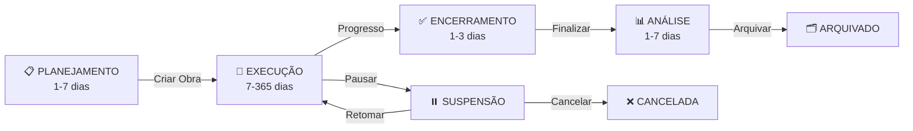

# 📋 Regras de Negócio Consolidadas - Obra Integrada

Documento centralizado com todas as regras de negócio operacionais da plataforma.

## 🏢 1. ESTRUTURA ORGANIZACIONAL E NÍVEIS

### 1.1 Estrutura Multi-Tenant
```
FORNECEDOR (Obra Integrada)
├── Super Admin (1-5 pessoas)
├── Product Owner (1-2 pessoas)
├── DevOps/Suporte N3 (2-3 pessoas)
└── Customer Success/Suporte N1-N2 (3-5 pessoas)

CLIENTE = TENANT (Construtora)
├── Admin (1-2 pessoas por empresa)
├── Gerentes de Obra (2-10 por empresa)
├── Supervisores (5-15 por obra)
└── Operacional/Colaboradores (10-200 por obra)
```

### 1.2 Segmentação por Nível
- **Nível SaaS (Plataforma)**: Gerencia clientes, servidores, suporte
- **Nível Administrativo (Construtora)**: Parametrização, gestão de usuários, relatórios
- **Nível Operacional (Canteiro)**: Apontamento de horas, tarefas, materiais

---

## ⚙️ 2. CICLOS DE VIDA E PROCESSOS

### 2.1 Ciclo de Vida da Obra



**Estados:**
- **PLANEJAMENTO**: Criar escopo, cronograma, orçamento, equipe
- **EXECUÇÃO**: Realizar apontamentos, controlar materiais, supervisionar
- **ENCERRAMENTO**: Finalizar tarefas, gerar relatórios, fechar contas
- **ANÁLISE**: Avaliar KPIs, lições aprendidas, documentação
- **ARQUIVADO**: Dados históricos, acesso em leitura

**Transições Possíveis:**
- PLANEJAMENTO → EXECUÇÃO (Aprovação do orçamento)
- EXECUÇÃO → SUSPENSÃO (Decisão gerencial)
- SUSPENSÃO → EXECUÇÃO (Retomada)
- EXECUÇÃO → ENCERRAMENTO (100% progresso)
- QUALQUER → CANCELADA (Decisão executiva)

### 2.2 Ciclo de Vida da Ordem de Serviço (OS)

```
CRIADA → PLANEJADA → ATRIBUÍDA → EM EXECUÇÃO → CONCLUÍDA
  ↓         ↓          ↓            ↓
CANCELADA (antes de execução)
          ↓
REVISÃO → APROVADA → FATURADA
  ↓
REJEITADA → EM EXECUÇÃO (correção)
```

**Regras por Estado:**
- **CRIADA**: Apenas visualizar, edit by creator
- **PLANEJADA**: Pode editar cronograma, recursos
- **ATRIBUÍDA**: Bloqueado para edição, só gerente pode desatribuir
- **EM EXECUÇÃO**: Bloqueado, apenas apontamentos
- **CONCLUÍDA**: Bloqueado, passar para revisão
- **REVISÃO**: Gerente valida, aprova ou rejeita
- **FATURADA**: Bloqueado, histórico

### 2.3 Ciclo de Vida do Apontamento

```
RASCUNHO → ENVIADO → VALIDADO → APROVADO → FATURADO
  ↓         ↓         ↓         ↓
EDITÁVEL  EDITÁVEL  BL EDIÇÃO BLOQUEADO
```

**Regras:**
- **RASCUNHO**: Criar, editar, deletar (operacional)
- **ENVIADO**: Não pode deletar, pode editar (sincronizado)
- **VALIDADO**: Apenas supervisor pode validar
- **APROVADO**: Gerente aprova para folha
- **FATURADO**: Bloqueado permanentemente

---

## 👥 3. REGRAS DE USUÁRIOS E PAPÉIS

### 3.1 Perfis de Acesso (RBAC)

#### NÍVEL SAAS (Plataforma)

**Super Admin - Obra Integrada**
```
Permissões:
- Criar/editar/deletar tenants (Construtoras)
- Ativar/bloquear clientes
- Visualizar todos os dados (audit global)
- Gestão de assinaturas e planos
- Acessar banco de dados direto (com log)
- Gerar relatórios de compliance
- Resetar senhas de qualquer usuário
- Visualizar logs de auditoria

Restrições:
- NÃO pode manipular dados de negócio sem autorização
- Todas ações devem gerar log (LGPD)
- Não pode deletar dados, apenas soft-delete
```

**DevOps / Suporte N3**
```
Permissões:
- Acessar servidor/cloud
- Deploy de código
- Gerenciar infraestrutura
- Acessar logs de sistema
- Resetar serviços
- Análise de performance
- Escalabilidade

Restrições:
- SEM acesso a dados de clientes
- SEM acesso a dados financeiros
- Todas ações em audit log
- Necessita aprovação para mudanças críticas
```

**Customer Success / Suporte N1-N2**
```
Permissões:
- Atender chamados de clientes
- Onboarding de empresas
- Resetar senha de clientes
- Ver status de tenants
- Escalar para N3 se necessário

Restrições:
- SEM acesso a dados financeiros
- SEM acesso a BD direto
- Apenas visualizar, não editar dados
```

---

#### NÍVEL ADMINISTRATIVO (Construtora)

**Admin Construtora**
```
Permissões:
- Criar/editar/deletar usuários da empresa
- Parametrizar empresa (CNPJ, razão social, etc)
- Definir estrutura de departamentos
- Gerir papéis e permissões internas
- Visualizar todos os dados da empresa
- Gerar relatórios executivos
- Gerir integração com ERP
- Bloquear/ativar usuários internos

Restrições:
- Limitado aos dados da própria empresa (tenant_id)
- NÃO pode ver dados de outras construtoras
- NÃO pode editar dados do SaaS
- NÃO pode resetar Super Admin
```

**Gerente de Obra**
```
Permissões:
- Criar/editar/deletar obras (dentro da empresa)
- Criar ordens de serviço
- Atribuir tarefas
- Supervisionar equipe
- Gerar relatórios da obra
- Validar apontamentos
- Controlar materiais
- Editar cronograma
- Visualizar custos

Restrições:
- Limitado às obras que gerencia
- NÃO pode deletar obras encerradas
- NÃO pode editar usuários
- NÃO pode ver dados financeiros de outras obras
```

**Supervisor de Obra**
```
Permissões:
- Visualizar tarefas da obra
- Validar apontamentos
- Adicionar observações
- Gerar relatórios simples
- Comunicar com operacional

Restrições:
- Leitura de maioria dos dados
- Editar apenas validações
- NÃO pode editar cronograma
- NÃO pode gerar relatórios executivos
```

---

#### NÍVEL OPERACIONAL (Canteiro)

**Operacional / Colaborador**
```
Permissões:
- Fazer apontamentos (entrada/saída)
- Visualizar tarefas do dia
- Registrar materiais consumidos
- Tirar fotos (documentação)
- Ver cronograma da obra
- Consultar dúvidas (FAQ)

Restrições:
- Visualizar apenas:
  - Suas tarefas
  - Dados gerais da obra
  - Seu próprio perfil
- NÃO pode:
  - Editar dados de outros
  - Ver dados de outras obras
  - Ver relatórios
  - Ver informações financeiras
```

---

### 3.2 Matriz de Permissões Granulares

| Ação | Super Admin | DevOps | CS | Admin | Gerente | Supervisor | Operacional |
|------|-----------|--------|----|----|---------|-----------|------------|
| Criar Tenant | ✅ | ❌ | ❌ | ❌ | ❌ | ❌ | ❌ |
| Criar Obra | ❌ | ❌ | ❌ | ✅ | ✅ | ❌ | ❌ |
| Criar OS | ❌ | ❌ | ❌ | ✅ | ✅ | ❌ | ❌ |
| Fazer Apontamento | ❌ | ❌ | ❌ | ❌ | ❌ | ❌ | ✅ |
| Validar Apontamento | ❌ | ❌ | ❌ | ✅ | ✅ | ✅ | ❌ |
| Ver Custos | ✅ | ❌ | ❌ | ✅ | ✅ | ❌ | ❌ |
| Ver Dados de Outro Tenant | ❌ | ❌ | ❌ | ❌ | ❌ | ❌ | ❌ |
| Resetar Senha | ✅ | ❌ | ✅ | ✅ | ❌ | ❌ | ❌ |
| Deletar Obra | ✅ | ❌ | ❌ | ✅ (só rascunho) | ❌ | ❌ | ❌ |

---

## 📊 4. REGRAS DE APONTAMENTO

### 4.1 Validações de Apontamento

**Regra 1: Horário Válido**
```
- Entrada: Entre 04:00 e 22:00
- Saída: Entre entrada e 23:59 do mesmo dia
- Duração mínima: 30 minutos
- Duração máxima: 12 horas
```

**Regra 2: Sobreposição de Tarefas**
```
- Mesmo dia: Não pode ter 2 apontamentos simultâneos
- Se sobreposição detectada:
  - Sistema ALERTA (não bloqueia)
  - Supervisor deve validar
  - Opções: Aprovar, Rejeitar, Dividir
```

**Regra 3: Cálculo de Horas**
```
- Horas trabalhadas = (Saída - Entrada) - Intervalo
- Intervalo padrão: 1 hora (configurável por obra)
- Se < 30 min: Não conta intervalo
- Arredonda para 15 minutos (0.25h)
```

**Regra 4: Apontamento Atrasado**
```
- Até 2 dias: Pode fazer sem permissão especial
- 2-7 dias: Precisa aprovação do Gerente
- > 7 dias: Precisa de justificativa + evidência (foto)
- > 30 dias: NÃO permite fazer
```

**Regra 5: Compatibilidade de Tarefas**
```
- Apontamento deve estar vinculado a uma OS válida
- OS deve estar em estado EM_EXECUÇÃO
- Operacional não pode criar apontamento sem OS
- Apontamento sem tarefa = Atividade geral (máx 1 por dia)
```

---

### 4.2 Cálculo de Custos

**Fórmula:**
```
CUSTO_APONTAMENTO = 
    Horas_Trabalhadas × 
    Custo_Hora_Operacional × 
    Fator_Encargo_Social

Exemplo:
- Colaborador: R$ 50/hora
- Encargo social: 1.4 (40% CLT)
- 8 horas trabalhadas = 8 × 50 × 1.4 = R$ 560
```

**Margem de Contribuição:**
```
MARGEM = 
    (Valor_Venda_OS - Custo_MO - Custo_Material) / 
    Valor_Venda_OS

KPI: Manter > 15% de margem
```

---

## 📦 5. REGRAS DE MATERIAIS E SUPRIMENTOS

### 5.1 Gestão de Inventário

**Tipos de Material:**
- **Consumível**: Consumido na execução (areia, cimento, etc)
- **Equipamento**: Reutilizável (ferramentas, máquinas)
- **Reposição**: Material que volta para estoque

**Regras:**
```
1. Material entra no canteiro por PEDIDO validado
2. Supervisão confirma recebimento fisicamente
3. Colaborador registra consumo no apontamento
4. Sistema diminui estoque automaticamente
5. Quando estoque < mínimo: ALERTA para reposição
6. Gerente aprova novo pedido
7. Se recusa: volta para estoque central
```

### 5.2 Tipos de Custo de Material

- **Custo Unitário**: Preço por unidade (kg, m, L, unidade)
- **Custo Total**: Quantidade × Preço unitário
- **Perda Padrão**: 5-10% (configurável por tipo)
- **Perda Efetiva**: Diferença entre entrada e saída

---

## 🏭 6. REGRAS DE OBRA

### 6.1 Parametrização Inicial (Setup)

Ao criar uma obra, OBRIGATÓRIO preencher:

```
Identificação:
├── Nome da obra
├── Descrição
├── Localização (endereço + GPS)
├── Cliente final (se diferente de tenant)
└── Data prevista início/fim

Financeiro:
├── Orçamento total
├── Margem mínima esperada (%)
├── Custo hora MO padrão
├── Encargo social (%)
└── Estrutura de fases/pacotes

Operacional:
├── Cronograma (fases, marcos)
├── Equipe mínima
├── Equipamentos necessários
├── Materiais principais
└── Riscos identificados
```

### 6.2 Controle de Progresso

```
Progresso Físico = 
    (Apontamentos Aprovados / Horas Planejadas) × 100%

Status da Obra:
- ⏱️ ADIANTADA: Progresso real > Progresso planejado + 5%
- ✅ NO_PRAZO: ±5% do planejado
- ⚠️ ATRASADA: Progresso real < Progresso planejado - 5%
- 🔴 CRÍTICO: Atraso > 20% com 5+ dias vencidos
```

**Gatilhos de Alerta:**
- Dias sem apontamento > 3
- Consumo de material > 110% do previsto
- Custo hora > 10% acima do orçado
- Progresso caindo (tendência negativa)

---

## 💰 7. REGRAS FINANCEIRAS

### 7.1 Faturamento

```
Etapas:
1. APONTAMENTOS APROVADOS
   └─ Validação de horas e tarefas

2. MATERIAIS FATURADOS
   └─ Consumo real confirmado

3. NOTA FISCAL GERADA
   └─ Dados: obra, período, custos

4. ENVIADA PARA CLIENTE
   └─ Email + Portal

5. PAGO
   └─ Reconciliação bancária
```

**Regra de Corte:**
```
Fatura referente ao PERÍODO (Ex: 01-30 de junho):
- Apontamentos com data ENTRE 01-30/06
- Aprovados ATÉ 03/07
- Gerada NÃO DEPOIS de 05/07
```

### 7.2 Retenção Fiscal

```
Se CNPJ do cliente tem débito na prefeitura:
- ALERTA: "Verificar retenção de impostos"
- Bloqueia fatura automaticamente
- Precisa aprovação do Admin
```

---

## 📊 8. REGRAS DE RELATÓRIOS E KPIS

### 8.1 KPIs por Nível

**Nível Executivo (Admin):**
- Margem média (15% target)
- Ticket médio por obra (R$ XXX)
- Taxa de adoção de app mobile (%)
- Custo por hora de apontamento

**Nível Operacional (Gerente):**
- Progresso vs Planejado (%)
- Consumo de material vs Orçado
- Dias sem acidentes (segurança)
- Horas retrabalho (rework)

**Nível Tático (Supervisor):**
- Apontamentos validados por dia
- Tarefas concluídas no prazo (%)
- Fotos documentadas por tarefa
- Tempo médio de validação

### 8.2 Auditorias e Compliance

```
Dados auditados:
- Cada apontamento: quem criou, editou, aprovou (timestamps)
- Cada acesso a dado sensível: quem, quando, para quê
- Mudança de permissão: por quem, quando
- Deleção: soft-delete com registro

Retenção:
- Apontamentos: 7 anos
- Logs de acesso: 2 anos
- Logs de auditoria: 5 anos (LGPD)
```

---

## 🔐 9. REGRAS DE SEGURANÇA E ACESSO

### 9.1 Isolamento de Dados

```
REGRA CRÍTICA: 
A query SEMPRE filtra por tenant_id do usuário logado

Exemplo:
SELECT * FROM obra WHERE id_tenant = :tenant_id_usuario

Violação desta regra = CRÍTICO SECURITY
```

### 9.2 Validação de Propriedade

```
Antes de qualquer operação:
1. Validar se usuário pertence ao tenant_id
2. Validar se dado pertence ao tenant_id
3. Se mismatch: BLOQUEAR + LOG + ALERTA
```

### 9.3 Criptografia de Dados

```
Dados criptografados em repouso:
- CPF de operacional
- Salário/custos hora
- Latitude/longitude (rastreamento)

Algoritmo: AES-256
Chave: Armazenada em Vault/HSM
```

---

## ✅ 10. REGRAS DE VALIDAÇÃO

### 10.1 Campos Obrigatórios por Tela

**Criar Obra:**
- Nome ✅
- Localização ✅
- Data início ✅
- Data fim (deve ser > início) ✅
- Orçamento (deve ser > 0) ✅

**Criar Apontamento:**
- Data ✅
- Hora entrada ✅
- Hora saída (deve ser > entrada) ✅
- Tarefa/OS ✅
- Supervisão de apontamento se overlap ✅

**Criar Usuário:**
- Nome ✅
- Email (válido e único no tenant) ✅
- Papel ✅
- Data vigência ✅

### 10.2 Formatos e Ranges

```
Email: RFC 5322 compliant + domínio válido
CPF: 11 dígitos + validação de checksum
CNPJ: 14 dígitos + validação de checksum
Data: ISO 8601 (YYYY-MM-DD)
Hora: 24h (HH:MM)
Moeda: 2 casas decimais, separador brasileiro (.)
```

---

**Última atualização**: 11 de junho de 2026
**Versão**: 2.0 (Consolidada)
