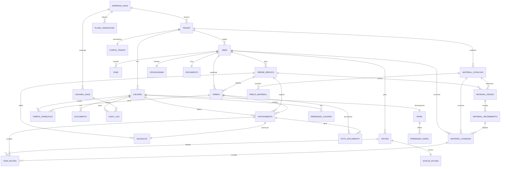

# 🗄️ Esquema de Banco de Dados - Detalhado

Documentação completa do banco de dados relacional com DER, relacionamentos e SQL.

---

## 📊 DIAGRAMA ENTIDADE-RELACIONAMENTO (DER) COMPLETO



---

## 📋 TABELAS E RELACIONAMENTOS DETALHADOS

### **1. TENANT (Construtora/Cliente)**

```sql
CREATE TABLE tenant (
    id_tenant SERIAL PRIMARY KEY,
    
    -- Identificação
    razao_social VARCHAR(255) NOT NULL,
    nome_fantasia VARCHAR(255),
    cnpj VARCHAR(14) UNIQUE NOT NULL,
    
    -- Dados de Contato
    email_corporativo VARCHAR(255) NOT NULL,
    telefone_corporativo VARCHAR(20),
    endereco_completo VARCHAR(500),
    
    -- Localização
    latitude DECIMAL(10, 8),
    longitude DECIMAL(11, 8),
    
    -- Status
    status ENUM('ATIVO', 'BLOQUEADO', 'SUSPENSO', 'CANCELADO') DEFAULT 'ATIVO',
    motivo_bloqueio VARCHAR(500),
    
    -- Financeiro
    plano_assinatura_id INT NOT NULL,
    data_inicio_assinatura DATE NOT NULL,
    data_proximo_vencimento DATE,
    
    -- Auditoria
    criado_por INT NOT NULL REFERENCES usuario_saas(id_usuario_saas),
    criado_em TIMESTAMP DEFAULT NOW(),
    atualizado_por INT REFERENCES usuario_saas(id_usuario_saas),
    atualizado_em TIMESTAMP,
    deletado_em TIMESTAMP (soft-delete)
);

-- Índices
CREATE INDEX idx_tenant_cnpj ON tenant(cnpj);
CREATE INDEX idx_tenant_status ON tenant(status);
CREATE INDEX idx_tenant_plano ON tenant(plano_assinatura_id);
```

**Relacionamentos:**
- 1:N com USUARIO (um tenant tem muitos usuários)
- 1:N com OBRA (um tenant realiza muitas obras)
- 1:N com MATERIAL_CATALOGO (catalogo de materiais por tenant)
- 1:1 com CONFIG_TENANT (parametrização)

---

### **2. USUARIO (Usuário do Sistema)**

```sql
CREATE TABLE usuario (
    id_usuario SERIAL PRIMARY KEY,
    
    -- Identificação
    id_tenant INT NOT NULL REFERENCES tenant(id_tenant) ON DELETE CASCADE,
    nome_completo VARCHAR(255) NOT NULL,
    email VARCHAR(255) NOT NULL,
    
    -- Segurança
    senha_hash VARCHAR(255) NOT NULL,  -- Bcrypt
    dois_fatores_habilitado BOOLEAN DEFAULT FALSE,
    codigo_2fa_secreto VARCHAR(32),  -- TOTP
    
    -- Dados Pessoais
    cpf VARCHAR(11),  -- Criptografado (AES-256)
    data_nascimento DATE,
    telefone VARCHAR(20),
    
    -- Profissionais
    papel_id INT NOT NULL REFERENCES papel(id_papel),
    departamento VARCHAR(100),
    
    -- Localização (para geolocalização)
    ultima_localizacao_latitude DECIMAL(10, 8),
    ultima_localizacao_longitude DECIMAL(11, 8),
    ultima_localizacao_em TIMESTAMP,
    
    -- Status
    status ENUM('ATIVO', 'INATIVO', 'BLOQUEADO', 'SUSPENSO') DEFAULT 'ATIVO',
    data_ativacao DATE,
    data_desativacao DATE,
    
    -- Auditoria
    criado_em TIMESTAMP DEFAULT NOW(),
    atualizado_em TIMESTAMP,
    ultimo_login TIMESTAMP,
    deletado_em TIMESTAMP (soft-delete)
);

-- Índices
CREATE INDEX idx_usuario_tenant ON usuario(id_tenant);
CREATE INDEX idx_usuario_email ON usuario(email);
CREATE INDEX idx_usuario_papel ON usuario(papel_id);
CREATE INDEX idx_usuario_status ON usuario(status);
CREATE UNIQUE INDEX idx_usuario_email_tenant ON usuario(email, id_tenant);  -- Email único por tenant
```

**Relacionamentos:**
- N:1 com TENANT (muitos usuários em um tenant)
- N:1 com PAPEL (muitos usuários com mesmo papel)
- 1:N com APONTAMENTO (um usuário faz muitos apontamentos)
- 1:N com TAREFA_ATRIBUICAO (usuário recebe tarefas)

---

### **3. PAPEL (Role-Based Access Control)**

```sql
CREATE TABLE papel (
    id_papel SERIAL PRIMARY KEY,
    
    -- Identificação
    nome VARCHAR(100) NOT NULL,
    descricao TEXT,
    
    -- Nível de Acesso
    nivel_acesso ENUM('SAAS', 'ADMIN', 'GERENTE', 'SUPERVISOR', 'OPERACIONAL') NOT NULL,
    
    -- Permissões (JSON armazenado)
    permissoes_json JSONB,  -- Ex: {"criar_obra": true, "validar_apontamento": true}
    
    -- Status
    ativo BOOLEAN DEFAULT TRUE,
    
    -- Auditoria
    criado_em TIMESTAMP DEFAULT NOW(),
    atualizado_em TIMESTAMP
);

-- Exemplos:
-- (1, 'Super Admin', 'Acesso total ao sistema', 'SAAS', {...}, true)
-- (2, 'Admin Construtora', 'Gerencia a construtora', 'ADMIN', {...}, true)
-- (3, 'Gerente de Obra', 'Gerencia obras', 'GERENTE', {...}, true)
-- (4, 'Supervisor', 'Supervisiona operacional', 'SUPERVISOR', {...}, true)
-- (5, 'Operacional', 'Coleta dados no canteiro', 'OPERACIONAL', {...}, true)
```

**Relacionamentos:**
- 1:N com USUARIO (um papel para muitos usuários)
- 1:N com PERMISSAO_PAPEL (um papel define muitas permissões)

---

### **4. PERMISSAO_PAPEL (Matriz de Permissões)**

```sql
CREATE TABLE permissao_papel (
    id_permissao SERIAL PRIMARY KEY,
    
    papel_id INT NOT NULL REFERENCES papel(id_papel),
    
    -- Ação/Recurso
    modulo VARCHAR(50) NOT NULL,  -- 'obra', 'apontamento', 'material', etc
    acao VARCHAR(50) NOT NULL,    -- 'criar', 'editar', 'deletar', 'visualizar'
    
    -- Permissão
    permitido BOOLEAN DEFAULT FALSE,
    
    -- Condições (opcional)
    condicoes_json JSONB,  -- Ex: {"apenas_propria_obra": true}
    
    UNIQUE(papel_id, modulo, acao)
);

-- Exemplos:
-- (1, 1, 'obra', 'criar', true, null)
-- (2, 2, 'apontamento', 'validar', true, null)
-- (3, 3, 'apontamento', 'fazer', true, {"apenas_suas_tarefas": true})
```

---

### **5. OBRA (Projeto Principal)**

```sql
CREATE TABLE obra (
    id_obra SERIAL PRIMARY KEY,
    
    -- Identificação
    id_tenant INT NOT NULL REFERENCES tenant(id_tenant),
    nome_obra VARCHAR(255) NOT NULL,
    descricao_escopo TEXT,
    
    -- Localização
    endereco_completo VARCHAR(500) NOT NULL,
    latitude DECIMAL(10, 8) NOT NULL,
    longitude DECIMAL(11, 8) NOT NULL,
    
    -- Cliente Final
    cliente_final_nome VARCHAR(255),
    cliente_final_cpf_cnpj VARCHAR(14),
    cliente_final_contato VARCHAR(100),
    
    -- Cronograma
    data_inicio_prevista DATE NOT NULL,
    data_fim_prevista DATE NOT NULL,
    data_inicio_real DATE,
    data_fim_real DATE,
    
    -- Financeiro
    valor_orcado DECIMAL(15, 2) NOT NULL,
    margem_minima_esperada DECIMAL(5, 2) DEFAULT 15.00,  -- %
    custo_hora_mo_padrao DECIMAL(10, 2) NOT NULL,
    encargo_social_percentual DECIMAL(5, 2) DEFAULT 40.00,
    intervalo_almoco_horas DECIMAL(3, 2) DEFAULT 1.00,
    
    -- Status
    status ENUM('PLANEJAMENTO', 'EXECUÇÃO', 'SUSPENSÃO', 'ENCERRAMENTO', 'ANÁLISE', 'ARQUIVADA', 'CANCELADA') 
        DEFAULT 'PLANEJAMENTO',
    motivo_suspensao VARCHAR(500),
    
    -- Progresso
    progresso_fisico_percentual DECIMAL(5, 2) DEFAULT 0.00,
    progresso_planejado_percentual DECIMAL(5, 2) DEFAULT 0.00,
    status_progresso ENUM('ADIANTADA', 'NO_PRAZO', 'ATRASADA', 'CRÍTICO') DEFAULT 'NO_PRAZO',
    
    -- Responsáveis
    gerente_responsavel_id INT REFERENCES usuario(id_usuario),
    
    -- Auditoria
    criado_por INT NOT NULL,
    criado_em TIMESTAMP DEFAULT NOW(),
    atualizado_em TIMESTAMP,
    deletado_em TIMESTAMP
);

-- Índices
CREATE INDEX idx_obra_tenant ON obra(id_tenant);
CREATE INDEX idx_obra_status ON obra(status);
CREATE INDEX idx_obra_gerente ON obra(gerente_responsavel_id);
CREATE INDEX idx_obra_data ON obra(data_inicio_prevista, data_fim_prevista);
```

**Relacionamentos:**
- N:1 com TENANT
- N:1 com USUARIO (gerente responsável)
- 1:N com FASE
- 1:N com ORDEM_SERVICO
- 1:1 com CRONOGRAMA
- 1:1 com ORCAMENTO

---

### **6. ORDEM_SERVICO (OS)**

```sql
CREATE TABLE ordem_servico (
    id_ordem_servico SERIAL PRIMARY KEY,
    
    -- Identificação
    id_obra INT NOT NULL REFERENCES obra(id_obra),
    codigo_os VARCHAR(50) UNIQUE,  -- Ex: OS-2026-001-0001
    titulo_servico VARCHAR(255) NOT NULL,
    descricao_detalhada TEXT,
    
    -- Pacote (agrupador)
    pacote_numero INT,  -- Ex: Fundações=1, Estrutura=2
    
    -- Cronograma
    data_inicio_prevista DATE NOT NULL,
    data_fim_prevista DATE NOT NULL,
    data_inicio_real DATE,
    data_fim_real DATE,
    
    -- Financeiro
    valor_unitario DECIMAL(15, 2),
    quantidade DECIMAL(10, 3),
    valor_total DECIMAL(15, 2),
    custo_estimado_mo DECIMAL(15, 2),
    custo_estimado_material DECIMAL(15, 2),
    
    -- Progresso
    progresso_percentual DECIMAL(5, 2) DEFAULT 0.00,
    horas_trabalhadas DECIMAL(10, 2) DEFAULT 0.00,
    horas_planejadas DECIMAL(10, 2),
    
    -- Status
    status ENUM('CRIADA', 'PLANEJADA', 'ATRIBUÍDA', 'EM_EXECUÇÃO', 'CONCLUÍDA', 'REVISÃO', 'APROVADA', 'FATURADA', 'CANCELADA')
        DEFAULT 'CRIADA',
    
    -- Responsáveis
    criador_id INT REFERENCES usuario(id_usuario),
    atribuido_para_id INT REFERENCES usuario(id_usuario),
    supervisor_id INT REFERENCES usuario(id_usuario),
    
    -- Auditoria
    criado_em TIMESTAMP DEFAULT NOW(),
    atualizado_em TIMESTAMP
);

-- Índices
CREATE INDEX idx_os_obra ON ordem_servico(id_obra);
CREATE INDEX idx_os_status ON ordem_servico(status);
CREATE INDEX idx_os_data ON ordem_servico(data_inicio_prevista, data_fim_prevista);
```

---

### **7. TAREFA**

```sql
CREATE TABLE tarefa (
    id_tarefa SERIAL PRIMARY KEY,
    
    -- Identificação
    id_obra INT NOT NULL REFERENCES obra(id_obra),
    id_ordem_servico INT REFERENCES ordem_servico(id_ordem_servico),
    nome_tarefa VARCHAR(255) NOT NULL,
    descricao TEXT,
    
    -- Sequência
    numero_sequencia INT,
    tarefa_pai_id INT REFERENCES tarefa(id_tarefa),  -- Para sub-tarefas
    
    -- Cronograma
    data_inicio_prevista DATE NOT NULL,
    data_fim_prevista DATE NOT NULL,
    duracao_horas DECIMAL(10, 2),
    
    -- Status
    status ENUM('PENDENTE', 'EM_EXECUÇÃO', 'CONCLUÍDA', 'BLOQUEADA') DEFAULT 'PENDENTE',
    
    -- Auditoria
    criado_em TIMESTAMP DEFAULT NOW()
);

-- Índices
CREATE INDEX idx_tarefa_obra ON tarefa(id_obra);
CREATE INDEX idx_tarefa_os ON tarefa(id_ordem_servico);
CREATE INDEX idx_tarefa_status ON tarefa(status);
```

---

### **8. APONTAMENTO (Registro de Horas)**

```sql
CREATE TABLE apontamento (
    id_apontamento SERIAL PRIMARY KEY,
    
    -- Identificação
    id_usuario INT NOT NULL REFERENCES usuario(id_usuario),
    id_obra INT NOT NULL REFERENCES obra(id_obra),
    id_ordem_servico INT REFERENCES ordem_servico(id_ordem_servico),
    id_tarefa INT REFERENCES tarefa(id_tarefa),
    
    -- Data e Hora
    data_apontamento DATE NOT NULL,
    hora_entrada TIME NOT NULL,
    hora_saida TIME NOT NULL,
    intervalo_almoco_horas DECIMAL(3, 2) DEFAULT 1.00,
    
    -- Cálculos
    horas_totais_bruto DECIMAL(5, 2) GENERATED ALWAYS AS 
        (EXTRACT(EPOCH FROM (hora_saida - hora_entrada)) / 3600.0),
    horas_trabalho DECIMAL(5, 2) GENERATED ALWAYS AS 
        (EXTRACT(EPOCH FROM (hora_saida - hora_entrada)) / 3600.0 - intervalo_almoco_horas),
    
    -- Localização
    latitude_entrada DECIMAL(10, 8),
    longitude_entrada DECIMAL(11, 8),
    latitude_saida DECIMAL(10, 8),
    longitude_saida DECIMAL(11, 8),
    
    -- Evidência
    foto_entrada_url VARCHAR(500),
    foto_saida_url VARCHAR(500),
    observacoes TEXT,
    
    -- Status
    status ENUM('RASCUNHO', 'ENVIADO', 'VALIDADO', 'APROVADO', 'FATURADO') DEFAULT 'RASCUNHO',
    
    -- Validações
    bloqueado_editar BOOLEAN DEFAULT FALSE,
    possui_sobreposicao BOOLEAN,
    motivo_sobreposicao TEXT,
    
    -- Cálculo de Custo
    custo_mao_obra DECIMAL(10, 2),
    -- custo_mao_obra = horas_trabalho × custo_hora_mo × (1 + encargo_social/100)
    
    -- Auditoria
    criado_em TIMESTAMP DEFAULT NOW(),
    atualizado_em TIMESTAMP,
    atualizado_por INT
);

-- Índices
CREATE INDEX idx_apontamento_usuario ON apontamento(id_usuario);
CREATE INDEX idx_apontamento_obra ON apontamento(id_obra);
CREATE INDEX idx_apontamento_data ON apontamento(data_apontamento);
CREATE INDEX idx_apontamento_status ON apontamento(status);
CREATE INDEX idx_apontamento_sobreposicao ON apontamento(id_usuario, data_apontamento) 
    WHERE NOT bloqueado_editar;
```

**Triggers necessários:**
```sql
-- Validar sobreposição de apontamentos
CREATE TRIGGER trg_validar_sobreposicao_apontamento
BEFORE INSERT OR UPDATE ON apontamento
FOR EACH ROW
EXECUTE FUNCTION validar_sobreposicao_apontamento();

-- Calcular custo automaticamente
CREATE TRIGGER trg_calcular_custo_apontamento
BEFORE INSERT OR UPDATE ON apontamento
FOR EACH ROW
EXECUTE FUNCTION calcular_custo_apontamento();
```

---

### **9. VALIDACAO (Fluxo de Aprovação)**

```sql
CREATE TABLE validacao (
    id_validacao SERIAL PRIMARY KEY,
    
    -- Referência
    id_apontamento INT NOT NULL UNIQUE REFERENCES apontamento(id_apontamento),
    
    -- Supervisor Valida
    validado_por INT REFERENCES usuario(id_usuario),
    validado_em TIMESTAMP,
    resultado_validacao ENUM('APROVADO', 'REJEITADO', 'PENDENTE') DEFAULT 'PENDENTE',
    observacoes_validacao TEXT,
    
    -- Gerente Aprova
    aprovado_por INT REFERENCES usuario(id_usuario),
    aprovado_em TIMESTAMP,
    resultado_aprovacao ENUM('APROVADO', 'REJEITADO', 'PENDENTE') DEFAULT 'PENDENTE',
    observacoes_aprovacao TEXT,
    
    -- Auditoria
    criado_em TIMESTAMP DEFAULT NOW()
);

-- Índices
CREATE INDEX idx_validacao_apontamento ON validacao(id_apontamento);
CREATE INDEX idx_validacao_status ON validacao(resultado_validacao);
```

---

### **10. MATERIAL_CATALOGO (Catálogo de Materiais)**

```sql
CREATE TABLE material_catalogo (
    id_material SERIAL PRIMARY KEY,
    
    -- Identificação
    id_tenant INT NOT NULL REFERENCES tenant(id_tenant),
    codigo_material VARCHAR(50) NOT NULL,
    nome_material VARCHAR(255) NOT NULL,
    descricao TEXT,
    
    -- Classificação
    categoria VARCHAR(100),  -- 'Concreto', 'Aço', 'Alvenaria', etc
    tipo ENUM('CONSUMÍVEL', 'EQUIPAMENTO', 'REPOSIÇÃO') DEFAULT 'CONSUMÍVEL',
    
    -- Unidade e Conversão
    unidade_padrao VARCHAR(20),  -- 'kg', 'm', 'L', 'un'
    equivalencia_kg DECIMAL(10, 3),  -- Para padronizar pesagem
    
    -- Preço
    preco_unitario DECIMAL(10, 2),
    preco_atualizado_em TIMESTAMP,
    
    -- Estoque
    estoque_minimo INT,
    estoque_maximo INT,
    
    -- Perda Padrão
    percentual_perda_padrao DECIMAL(5, 2) DEFAULT 5.00,
    
    -- Fornecedor
    fornecedor_padrao VARCHAR(255),
    
    -- Status
    ativo BOOLEAN DEFAULT TRUE,
    
    -- Auditoria
    criado_em TIMESTAMP DEFAULT NOW()
);

-- Índices
CREATE INDEX idx_material_tenant ON material_catalogo(id_tenant);
CREATE INDEX idx_material_codigo ON material_catalogo(codigo_material);
CREATE INDEX idx_material_categoria ON material_catalogo(categoria);
```

---

### **11. MATERIAL_PEDIDO (Requisição de Material)**

```sql
CREATE TABLE material_pedido (
    id_pedido SERIAL PRIMARY KEY,
    
    -- Identificação
    id_obra INT NOT NULL REFERENCES obra(id_obra),
    id_ordem_servico INT REFERENCES ordem_servico(id_ordem_servico),
    codigo_pedido VARCHAR(50) UNIQUE,
    
    -- Material
    id_material INT NOT NULL REFERENCES material_catalogo(id_material),
    quantidade_solicitada DECIMAL(12, 3) NOT NULL,
    quantidade_recebida DECIMAL(12, 3) DEFAULT 0.00,
    
    -- Valores
    preco_unitario DECIMAL(10, 2),
    valor_total DECIMAL(15, 2) GENERATED ALWAYS AS 
        (quantidade_solicitada × preco_unitario),
    
    -- Status
    status ENUM('SOLICITADO', 'APROVADO', 'PEDIDO_FORNECEDOR', 'RECEBIDO', 'PARCIAL', 'CANCELADO')
        DEFAULT 'SOLICITADO',
    
    -- Datas
    data_solicitacao DATE NOT NULL,
    data_aprovacao DATE,
    data_entrega_prevista DATE,
    data_entrega_real DATE,
    
    -- Auditoria
    solicitado_por INT REFERENCES usuario(id_usuario),
    aprovado_por INT REFERENCES usuario(id_usuario)
);

-- Índices
CREATE INDEX idx_pedido_obra ON material_pedido(id_obra);
CREATE INDEX idx_pedido_status ON material_pedido(status);
```

---

### **12. MATERIAL_CONSUMO (Saída de Estoque)**

```sql
CREATE TABLE material_consumo (
    id_consumo SERIAL PRIMARY KEY,
    
    -- Referência
    id_apontamento INT NOT NULL REFERENCES apontamento(id_apontamento),
    id_material INT NOT NULL REFERENCES material_catalogo(id_material),
    id_pedido INT REFERENCES material_pedido(id_pedido),
    
    -- Quantidade
    quantidade_consumida DECIMAL(12, 3) NOT NULL,
    unidade VARCHAR(20),
    
    -- Valores
    preco_unitario DECIMAL(10, 2),
    valor_consumo DECIMAL(15, 2),
    
    -- Observações
    observacoes TEXT,
    
    -- Auditoria
    registrado_em TIMESTAMP DEFAULT NOW(),
    registrado_por INT REFERENCES usuario(id_usuario)
);

-- Índices
CREATE INDEX idx_consumo_apontamento ON material_consumo(id_apontamento);
CREATE INDEX idx_consumo_material ON material_consumo(id_material);
CREATE INDEX idx_consumo_data ON material_consumo(registrado_em);
```

---

### **13. FATURA (Documento Fiscal)**

```sql
CREATE TABLE fatura (
    id_fatura SERIAL PRIMARY KEY,
    
    -- Identificação
    id_obra INT NOT NULL REFERENCES obra(id_obra),
    numero_fatura VARCHAR(50) UNIQUE,
    serie_fatura VARCHAR(20),
    
    -- Período
    data_inicio_periodo DATE NOT NULL,
    data_fim_periodo DATE NOT NULL,
    
    -- Valores
    valor_mao_obra DECIMAL(15, 2),
    valor_material DECIMAL(15, 2),
    valor_impostos DECIMAL(15, 2),
    valor_total DECIMAL(15, 2),
    
    -- Status
    status ENUM('RASCUNHO', 'GERADA', 'ENVIADA', 'PAGA', 'CANCELADA') DEFAULT 'RASCUNHO',
    
    -- Datas
    data_geracao DATE,
    data_envio DATE,
    data_vencimento DATE,
    data_pagamento DATE,
    
    -- Auditoria
    gerada_por INT REFERENCES usuario(id_usuario),
    criado_em TIMESTAMP DEFAULT NOW()
);

-- Índices
CREATE INDEX idx_fatura_obra ON fatura(id_obra);
CREATE INDEX idx_fatura_status ON fatura(status);
CREATE INDEX idx_fatura_data ON fatura(data_geracao);
```

---

### **14. AUDIT_LOG (Auditoria LGPD)**

```sql
CREATE TABLE audit_log (
    id_log SERIAL PRIMARY KEY,
    
    -- Quem
    id_usuario_saas INT REFERENCES usuario_saas(id_usuario_saas),
    id_usuario INT REFERENCES usuario(id_usuario),
    
    -- O que
    entidade VARCHAR(100) NOT NULL,  -- 'usuario', 'apontamento', 'fatura'
    id_registro INT,
    acao VARCHAR(50) NOT NULL,  -- 'CREATE', 'UPDATE', 'DELETE', 'LOGIN', 'ACESSO'
    
    -- Detalhes
    valores_anterior JSONB,  -- Para UPDATE
    valores_novo JSONB,
    
    -- Contexto
    endereco_ip VARCHAR(45),
    user_agent VARCHAR(500),
    id_tenant INT,
    
    -- Quando
    criado_em TIMESTAMP DEFAULT NOW()
);

-- Índices para performance
CREATE INDEX idx_audit_usuario ON audit_log(id_usuario);
CREATE INDEX idx_audit_data ON audit_log(criado_em);
CREATE INDEX idx_audit_entidade ON audit_log(entidade, id_registro);
```

**Política de Retenção:**
- Apontamentos: 7 anos
- Logs de acesso: 2 anos
- Audit logs: 5 anos (LGPD)

---

## 📐 RELACIONAMENTOS RESUMIDOS

| Tabela 1 | Tipo | Tabela 2 | Descrição |
|----------|------|----------|-----------|
| TENANT | 1:N | USUARIO | Um tenant tem múltiplos usuários |
| TENANT | 1:N | OBRA | Um tenant realiza múltiplas obras |
| USUARIO | N:1 | PAPEL | Muitos usuários desempenham um papel |
| OBRA | 1:N | ORDEM_SERVICO | Uma obra gera múltiplas OS |
| ORDEM_SERVICO | 1:N | TAREFA | Uma OS detalha múltiplas tarefas |
| USUARIO | 1:N | APONTAMENTO | Um usuário faz múltiplos apontamentos |
| APONTAMENTO | 1:1 | VALIDACAO | Cada apontamento tem uma validação |
| MATERIAL_CATALOGO | 1:N | MATERIAL_PEDIDO | Um material pode ter múltiplos pedidos |
| MATERIAL_PEDIDO | 1:N | MATERIAL_CONSUMO | Um pedido pode gerar múltiplos consumos |
| OBRA | 1:N | FATURA | Uma obra gera múltiplas faturas |

---

## 🔐 REGRAS DE INTEGRIDADE

### Restrições de Chave Estrangeira
```sql
-- Ao deletar tenant, deletar em cascata: usuários, obras, etc
ALTER TABLE usuario ADD CONSTRAINT fk_usuario_tenant
    FOREIGN KEY (id_tenant) REFERENCES tenant(id_tenant) ON DELETE CASCADE;

-- Ao deletar obra, deletar em cascata: tarefas, apontamentos
ALTER TABLE tarefa ADD CONSTRAINT fk_tarefa_obra
    FOREIGN KEY (id_obra) REFERENCES obra(id_obra) ON DELETE CASCADE;

-- Soft delete: não permite deletar fisicamente dados críticos
-- Usar deletado_em TIMESTAMP em vez de DELETE statement
```

### Validações de Negócio
```sql
-- Hora fim > hora início
ALTER TABLE apontamento ADD CONSTRAINT check_hora_saida_apos_entrada
    CHECK (hora_saida > hora_entrada);

-- Data fim > data início
ALTER TABLE obra ADD CONSTRAINT check_data_fim_apos_inicio
    CHECK (data_fim_prevista > data_inicio_prevista);

-- Quantidade > 0
ALTER TABLE material_pedido ADD CONSTRAINT check_quantidade_positiva
    CHECK (quantidade_solicitada > 0);
```

---

## 📊 VIEWS ÚTEIS (Queries Pré-compiladas)

```sql
-- View: Apontamentos com custo calculado
CREATE VIEW v_apontamento_com_custo AS
SELECT 
    a.id_apontamento,
    u.nome_completo,
    o.nome_obra,
    a.data_apontamento,
    a.horas_trabalho,
    o.custo_hora_mo_padrao,
    o.encargo_social_percentual,
    (a.horas_trabalho * o.custo_hora_mo_padrao * (1 + o.encargo_social_percentual/100)) as custo_total,
    a.status
FROM apontamento a
JOIN usuario u ON a.id_usuario = u.id_usuario
JOIN obra o ON a.id_obra = o.id_obra;

-- View: Progresso da Obra
CREATE VIEW v_progresso_obra AS
SELECT 
    o.id_obra,
    o.nome_obra,
    COUNT(DISTINCT CASE WHEN a.status = 'APROVADO' THEN a.id_apontamento END) as apontamentos_aprovados,
    SUM(CASE WHEN a.status = 'APROVADO' THEN a.horas_trabalho ELSE 0 END) as horas_trabalhadas_aprovadas,
    os.horas_planejadas,
    ROUND(100.0 * SUM(CASE WHEN a.status = 'APROVADO' THEN a.horas_trabalho ELSE 0 END) / NULLIF(os.horas_planejadas, 0), 2) as progresso_percent
FROM obra o
LEFT JOIN ordem_servico os ON o.id_obra = os.id_obra
LEFT JOIN apontamento a ON os.id_ordem_servico = a.id_ordem_servico
GROUP BY o.id_obra, o.nome_obra, os.horas_planejadas;

-- View: Faturamento por Obra
CREATE VIEW v_faturamento_obra AS
SELECT 
    o.id_obra,
    o.nome_obra,
    SUM(f.valor_total) as total_faturado,
    COUNT(DISTINCT f.id_fatura) as quantidade_faturas,
    SUM(CASE WHEN f.status = 'PAGA' THEN f.valor_total ELSE 0 END) as valor_pago,
    SUM(CASE WHEN f.status != 'PAGA' THEN f.valor_total ELSE 0 END) as valor_pendente
FROM obra o
LEFT JOIN fatura f ON o.id_obra = f.id_obra
GROUP BY o.id_obra, o.nome_obra;
```

---

**Última atualização**: 11 de junho de 2026
**Versão**: 1.0
