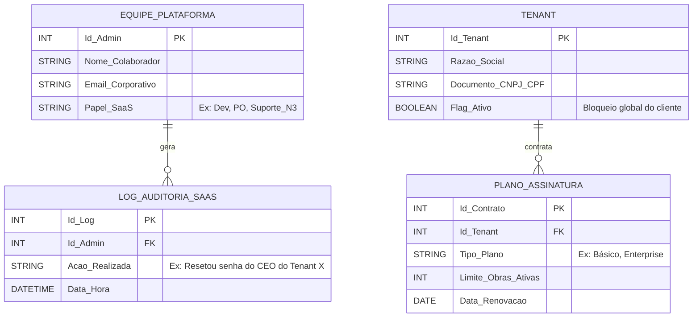

# 🗺️ MER-001: Diagrama da Plataforma (SaaS Obra Integrada)

Este diagrama mapeia o banco de dados interno da empresa fornecedora do software. É a camada de infraestrutura, suporte e faturamento. Nenhuma construtora tem acesso a essas tabelas.

## 1. Regras de Negócio do Nível SaaS
* **Equipe Isolada:** Os usuários da plataforma (Devs, Suporte, PO) não existem na tabela de trabalhadores das construtoras.
* **Gestão de Tenants:** A Plataforma enxerga as Construtoras (Tenants) como "Clientes pagantes", podendo bloquear o acesso geral de uma empresa por inadimplência.
* **Auditoria Global:** Toda ação de um desenvolvedor ou suporte técnico no banco de dados deve gerar um log para conformidade com a LGPD.

## 2. Diagrama Visual (MER SaaS)

