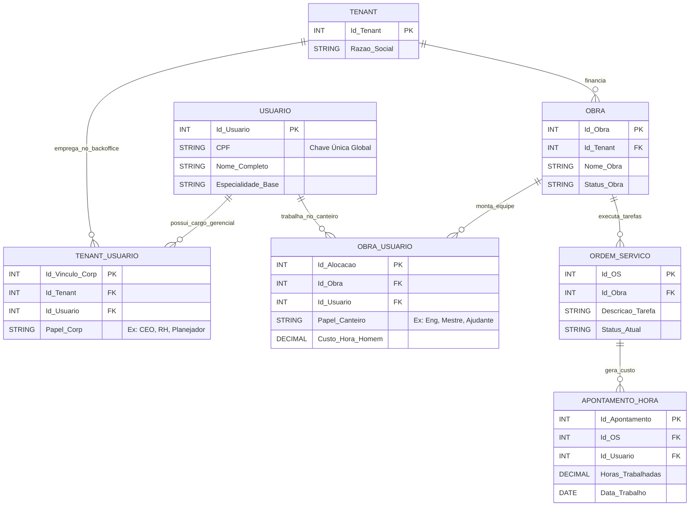

# 🗺️ MER-002: Diagrama do Cliente (Construtora e Obra)

Este diagrama representa o ambiente isolado (Multi-Tenant) de uso da construtora. Tudo o que acontece aqui dentro está atrelado ao `Id_Tenant` da empresa que contratou o sistema.

## 1. Regras de Hierarquia do Cliente
* **Visão Corporativa (Backoffice):** O relacionamento entre o Usuário e a Construtora (`TENANT_USUARIO`). É aqui que ficam os perfis transversais: Diretores, RH e Orçamentistas que enxergam todas as obras da empresa.
* **Visão de Canteiro (Operação):** O relacionamento entre o Usuário e o Canteiro (`OBRA_USUARIO`). É aqui que ficam os perfis locais: Engenheiro Residente, Mestre de Obras e Pedreiros, cujo acesso é restrito apenas ao cercado daquela obra.

## 2. Diagrama Visual (MER Cliente)

