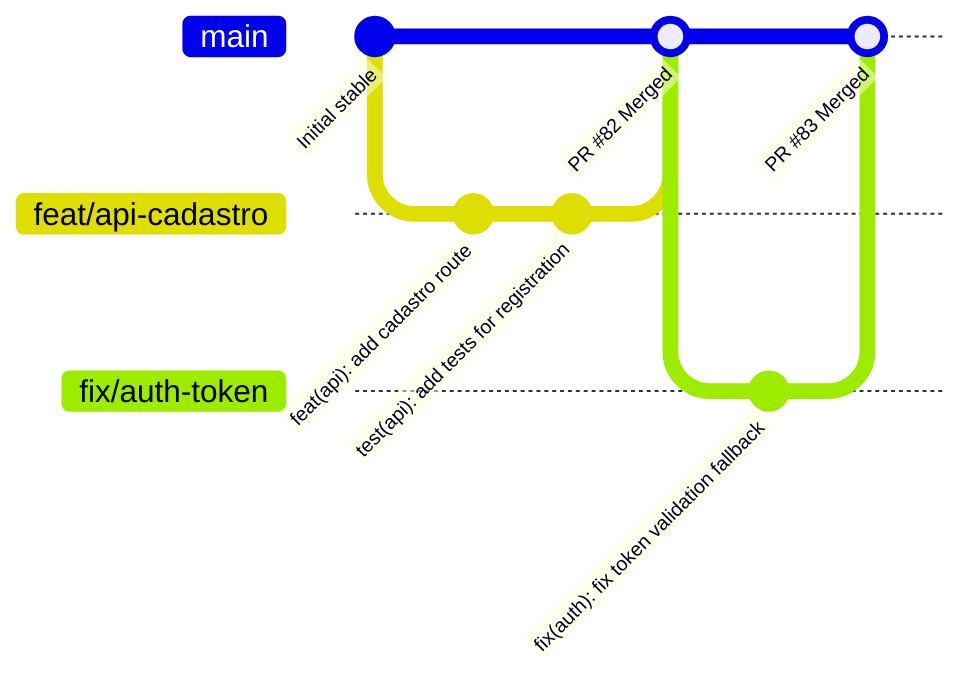

# 🐙 Guia de Fluxo de Trabalho Git (Git Workflow)

Este documento descreve o padrão de ramificação (branching), nomenclatura, escrita de commits e processo de revisão de código (Code Review) adotado na plataforma **Obra Integrada**. O cumprimento dessas regras é obrigatório para todos os membros da equipe de engenharia.

---

## 1. Modelo de Ramificação: Trunk-Based Development (TBD)

Adotamos uma abordagem de **Trunk-Based Development leve**. Todos os desenvolvedores criam branches de curta duração que são integradas diretamente na branch principal (`main`) após revisão e testes automatizados.



### Regras do Trunk-Based Development:
1. **Curta Duração:** Branches devem idealmente durar no máximo **2 a 3 dias**.
2. **Integração Frequente:** Realize pull da `main` diariamente para manter sua branch local atualizada e evitar grandes conflitos de mesclagem.
3. **Nenhum Push Direto na Main:** A branch `main` é protegida. Qualquer alteração deve passar por um Pull Request (PR) com revisão.

---

## 2. Nomenclatura Padrão de Branches

Para manter a clareza sobre o propósito de cada branch no GitHub, utilize a seguinte convenção de prefixo:

| Prefixo | Finalidade | Exemplo de Nome de Branch |
| :--- | :--- | :--- |
| `feat/` | Implementação de nova funcionalidade | `feat/rh-cadastro-matricula` |
| `fix/` | Resolução de bugs e erros em código | `fix/auth-jwt-expiration` |
| `chore/` | Mudanças de infraestrutura, dependências ou builds | `chore/prisma-schema-lint` |
| `docs/` | Atualizações exclusivas de documentação | `docs/ajuste-readme` |
| `refactor/` | Refatoração de código sem alteração lógica | `refactor/api-controllers` |
| `hotfix/` | Correções urgentes aplicadas direto em produção | `hotfix/cors-origins-prod` |

---

## 3. Padrão de Commits: Conventional Commits

Todas as mensagens de commit devem seguir a especificação [Conventional Commits v1.0.0](https://www.conventionalcommits.org/).

### Estrutura da Mensagem
```
<tipo>(<escopo opcional>): <descrição curta no imperativo e em minúsculas>
```

### Tipos Permitidos
* **`feat`:** Introduz um novo comportamento ou funcionalidade.
  * *Exemplo:* `feat(api): adicionar endpoint de log de auditoria`
* **`fix`:** Corrige um bug ou problema.
  * *Exemplo:* `fix(web): corrigir redirecionamento de rotas do sidebar`
* **`chore`:** Modificações de configuração, pacotes e tarefas repetitivas.
  * *Exemplo:* `chore(deps): atualizar pacote jsonwebtoken`
* **`refactor`:** Mudança no código que não corrige um bug nem adiciona funcionalidade.
  * *Exemplo:* `refactor(db): isolar filtros de tenant nas consultas do prisma`
* **`docs`:** Alterações exclusivas em arquivos markdown ou documentações técnicas.
  * *Exemplo:* `docs(scrum): adicionar guia de fluxo git`
* **`test`:** Adiciona ou modifica testes automatizados.
  * *Exemplo:* `test(backend): criar testes de integração para rhRoutes`

---

## 4. Ciclo de Pull Request e Revisão (Code Review)

O fluxo completo de integração de código compreende as seguintes etapas:

```
[Local Branch] ──► [Push to GitHub] ──► [Open PR] ──► [CI Checks & Peer Review] ──► [Squash & Merge]
```

1. **Abertura do Pull Request (PR):**
   * Preencha o template oficial de Pull Request.
   * Vincule a Issue correspondente no campo de descrição (ex: `Closes #12`).
2. **Revisão Obrigatória (Peer Review):**
   * Todo PR precisa de pelo menos **1 aprovação** de outro desenvolvedor.
   * Comentários construtivos devem ser feitos na aba *Files Changed* do PR.
3. **Resolução de Conversas:**
   * O autor do PR deve responder aos feedbacks e atualizar o código caso necessário. As discussões devem ser formalmente resolvidas antes do merge.
4. **Estratégia de Merge: Squash and Merge:**
   * Unifica todos os commits da branch de desenvolvimento em um único commit limpo na `main`, mantendo o histórico de commits do repositório limpo e legível.

---

## 5. Validação Local (Antes do Push)

Para evitar quebras na esteira de CI do GitHub Actions, execute os seguintes comandos localmente na raiz do projeto antes de enviar sua branch:

```bash
# Executar o linter no frontend
npm run lint --prefix frontend/vite-project

# Executar a suíte de testes no backend
npm run test --prefix backend
```

---
**Status:** ✅ Aprovado pela equipe  
**Última atualização:** 13 de junho de 2026  
**Responsável por Gestão:** Lucas (Gerente de Projeto)  
