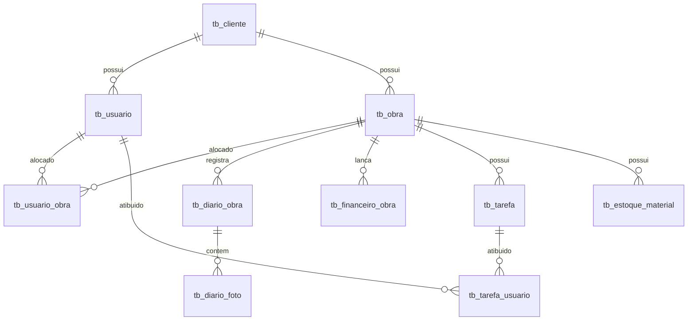

# 🗺️ Obra Integrada — Resumo de Contexto Técnico e Operacional
## Guia de Integração Rápida e Visão Geral da Plataforma para IAs

Este documento consolida a arquitetura, o banco de dados, a segurança, as regras de negócios e o mapa de documentação da plataforma **Obra Integrada** em uma estrutura de leitura rápida para inteligências artificiais.

---

## 1. Visão Geral do Produto e Negócios

- **Objetivo:** Plataforma SaaS B2B para gestão física e financeira de canteiros de obras voltada para construtoras de pequeno e médio porte (PMEs).
- **Problema Resolvido:** Eliminar a dependência de cadernos físicos e planilhas dispersas no canteiro, mitigar desvios de custos (INCC/SINAPI) e proteger juridicamente a empresa com fotos geolocalizadas e conformidade legal (LGPD + NRs).
- **Módulos do Sistema:**
  1. **Core:** Isolamento lógico multi-tenant por ID de cliente.
  2. **Obras:** CRUD, equipes associadas e controle de progresso.
  3. **Diário de Obra (RDO):** Registro diário com fotos geolocalizadas (GPS) e status de auditoria.
  4. **Tarefas:** Cronograma e distribuição de atividades com Gantt.
  5. **Financeiro:** Receitas, despesas e anexos de comprovantes por obra.
  6. **RH & Segurança:** Registro de trabalhadores, apontamentos de ponto e controle de certificações de segurança obrigatórias (NR-10, NR-35).

---

## 2. Estrutura do Banco de Dados (PostgreSQL via Prisma ORM)

O banco de dados é modelado no Prisma (`apps/api/src/prisma/schema.prisma`) com 14 tabelas principais correlacionadas por cliente/tenant:



### Tabelas Chave
1. `tb_cliente` (Tenant/Construtora): Razão social, CNPJ, dados de faturamento.
2. `tb_usuario`: Cadastro geral com e-mail, senha_hash, papel (role) e id_tenant.
3. `tb_papel` & `tb_permissao_papel` (RBAC): Matriz de permissões por papel.
4. `tb_obra`: Detalhes da obra, latitude/longitude, CNO, ART do engenheiro.
5. `tb_diario_obra`: Data, clima, ocorrências, status de auditoria.
6. `tb_diario_foto`: Foto do canteiro com metadados de geolocalização (GPS) e data/hora.
7. `tb_financeiro_obra`: Lançamentos de despesas e receitas por obra com anexo de comprovante.
8. `tb_certificacao`: Controle de exames (PCMSO/NR-7) e certificações de segurança de campo.

---

## 3. Estrutura de Diretórios do Projeto

```
obra-integrada/
├── .cursorrules                        # Regras e hooks automáticos do Agente IDE
├── package.json                        # Monorepo workspaces orquestrador
├── CHANGELOG.md                        # Histórico de entregas e versões do sistema
├── CONTRIBUTING.md                     # Guia de contribuição e workflow do time B2B
├── SECURITY.md                         # Canal para reporte de vulnerabilidades
├── backend/                            # API Node.js/Express (ESM + Prisma + Express)
├── frontend/vite-project/              # Frontend React + Vite
└── ob_obra_integrada/                  # Vault Obsidian de negócios e especificações
    ├── AUDITORIA-CONFORMIDADE-PROJETO.md # Auditoria de conformidade (jun/2026)
    └── 00-Index/                       # Navegação e Tiers da documentação
        ├── 10 - Produto e Negocios/    # Lean Canvas, BMC, Empresa, etc.
        ├── 20 - Documentacao e Tecnologias/ # Requisitos, Identidade visual, Telas, Banca, Auditoria inicial
        ├── 30 - Banco de Dados e Modelagem/ # Esquema de DB, DER, Master Data, Scripts
        ├── 40 - Back-end, APIs e Seguranca/ # Endpoints, Controllers, Integrações, Segurança, ADRs
        ├── 40 - Execucao e Implementacao/ # Checklists de Sprint e Cronogramas
        ├── 50 - Front-end e Interfaces/ # Telas desktop, mobile, UI/UX
        ├── 60 - Infraestrutura, Cloud e DevOps/ # Nuvem, CI/CD, Logs e Monitoramento
        ├── 70 - Gestao Agil (Scrum)/    # Backlogs de épicos e Sprints ativas
        ├── 80 - Customer Success (CS) e Suporte/ # Manuais, QA, Changelogs, Regras de Desenvolvimento Equipe
        └── 90 - Sistema Obsidian/       # Templates, Agente IDE (prompts/skills), Propostas de Atualizacao
```

---

## 4. Estado de Segurança e Conformidade (Status da Auditoria)

### Vulnerabilidades Críticas de Código Identificadas (P0 — Sprint 0)
1. **Fallback de Segredo JWT:** O arquivo `authMiddleware.js` aceita a string `"SUPER_SECRET"` como chave caso `JWT_SECRET` não esteja no `.env`.
2. **CORS Aberto:** O entrypoint backend utiliza `cors()` sem argumentos, permitindo acesso de qualquer origem.
3. **Falta de Tabela de Auditoria:** O backend tenta fazer INSERT de logs na tabela `tb_log_auditoria`, mas ela não está criada no schema Prisma atual.
4. **Falta de Proteção de Headers:** Ausência do middleware `helmet` e de Content Security Policy (CSP) na API e no Frontend.

### Conformidade LGPD & Prazos da ANPD (Resolução nº 15/2024)
- **Classificação:** O sistema trata dados pessoais comuns (CPF, nome) e pessoais sensíveis (exames PCMSO de saúde e segurança NR-7).
- **Prazo de Notificação:** Como agente de pequeno porte/startup, a Obra Integrada tem o prazo de **6 dias úteis** a partir da ciência do incidente para notificar a ANPD em caso de vazamentos (Resolução ANPD nº 15/2024 + Resolução nº 2/2022).
- **Canal de Privacidade:** E-mail `privacidade@obraintegrada.com.br` para exercício de direitos do titular (LGPD art. 18).

---

## 5. Regras do Fluxo de Trabalho do Time

- **Branching de Código:** A branch `main` é protegida. Desenvolvedores criam branches de feature (`feat/`, `fix/`, `chore/`), abrem Pull Request seguindo a especificação de Conventional Commits e necessitam de aprovação antes do merge (Squash & Merge).
- **Branching de Documentação (Doc Branching):** Propostas de alteração nos arquivos oficiais da pasta `ob_obra_integrada/` não podem ser feitas diretamente. O desenvolvedor deve criar uma proposta na pasta `ob_obra_integrada/00-Index/90 - Sistema Obsidian/95 - Propostas de Atualizacao/` seguindo o template do [README de propostas](file:///d:/Repositorios/antigravity/obra-integrada/ob_obra_integrada/00-Index/90%20-%20Sistema%20Obsidian/95%20-%20Propostas%20de%20Atualizacao/README.md). A aprovação, consolidação e atualização de versão no arquivo principal são de responsabilidade exclusiva do Líder do Projeto (Admin).
