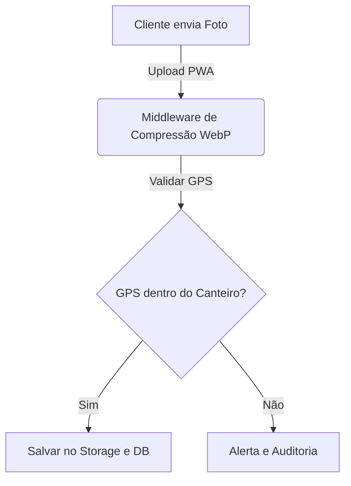

# 📋 Agent Skill: Standard Docs Builder
## Instruções para Criação e Manutenção de Documentação Técnica e Normativa

Esta skill orienta o Agente IDE sobre como criar, estruturar e atualizar arquivos de documentação markdown na pasta `ob_obra_integrada/00-Index/` do repositório, garantindo um padrão visual e conceitual profissional que atenda a bancas acadêmicas e auditorias.

---

## 1. Estrutura Padrão do Documento

Todo documento novo na pasta `ob_obra_integrada/00-Index/` deve seguir este modelo estrutural básico:

```markdown
# [TÍTULO DO DOCUMENTO] — Obra Integrada
## [Subtítulo autoexplicativo]

**Versão:** 1.0 | **Data:** [DD/MM/AAAA] | **Referência:** [Norma Técnica ou Decisão, ex: IEEE 29148, ISO 27001, ANPD 15/2024]
**Status:** [Vigente / Rascunho / Em Revisão]

---

## 1. Propósito e Contexto
[Explicar o objetivo do documento e o problema de negócio que ele resolve.]

## 2. [Conteúdo Técnico]
...
```

---

## 2. Regras de Formatação e Estilo

### 2.1 Uso de Alertas (GitHub-style Alerts)
Utilize alertas estrategicamente para chamar a atenção para pontos críticos:

```markdown
> [!NOTE]
> Informações de contexto ou detalhes técnicos de suporte.

> [!IMPORTANT]
> Requisitos obrigatórios de negócio ou técnicos.

> [!WARNING]
> Riscos de quebra de compatibilidade ou problemas comuns.

> [!CAUTION]
> Pontos críticos de segurança, risco de vazamento de dados ou perda de informações.
```

### 2.2 Diagramas em Mermaid
Sempre que descrever fluxos, integrações ou arquiteturas, inclua diagramas Mermaid integrados para visualização gráfica.
- **Regra de Ouro:** Coloque rótulos com aspas se houver caracteres especiais. Exemplo: `id["Texto (Info Extra)"]` em vez de `id[Texto (Info Extra)]`.
- **Exemplo de Fluxo:**


### 2.3 Links de Arquivos e Símbolos
- Sempre crie links absolutos com o esquema `file:///` para facilitar a navegação direta de quem lê o markdown no editor.
- **Formato Correto:** `[Nome do Arquivo](file:///d:/Repositorios/antigravity/obra-integrada/ob_obra_integrada/00-Index/20 - Documentacao e Tecnologias/Requisitos/PRD.md)`.
- **Formato Incorreto:** Não use backticks dentro da ancoragem (ex: ``[`prd.md`](...)``), pois isso quebra a renderização em alguns editores.

---

## 3. Padrões de Conteúdo por Categoria

- **Requisitos (PRD/SRS):** Devem sempre detalhar o ID do requisito, a descrição técnica, o módulo associado e o nível de prioridade (P0/P1/P2) conforme o backlog ágil.
- **Segurança (Threat Model):** Deve mapear ameaças associando-as a uma categoria STRIDE (S-Spoofing, T-Tampering, R-Repudiation, I-Information Disclosure, D-Denial of Service, E-Elevation of Privilege) e seu nível de gravidade baseado em probabilidade vs impacto.
- **Processo Operacional (BCP/DRP):** Deve sempre conter metas numéricas claras de **RTO** (Recovery Time Objective) e **RPO** (Recovery Point Objective) e um fluxo passo a passo em tópicos para tomada de ação.
